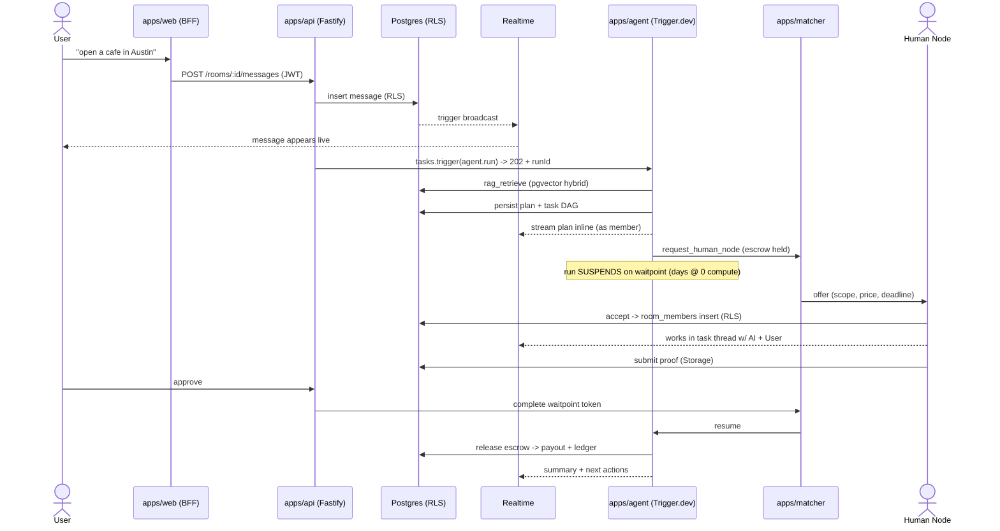
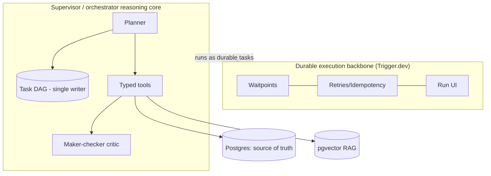

# Diagrams

> Source-of-truth diagrams (Mermaid, kept in-repo so they version with the docs) plus exported assets (ERD, DAG, sequence). Update a diagram in the same PR as the behavior it depicts.

## Core loop (sequence)

## Two-layer brain (component)

## Planned exports

- `erd.*` — full entity-relationship diagram (from [data-model.md](../10-architecture/data-model.md)).
- `task-state.*` — the per-task state machine ([business-projects-workflow.md](../30-modules/business-projects-workflow.md)).
- `topology.*` — deployment topology ([architecture.md](../10-architecture/architecture.md)).

> Artifacts note: rendered exports (SVG/PNG) are generated from these Mermaid sources; keep the Mermaid the source of truth.
